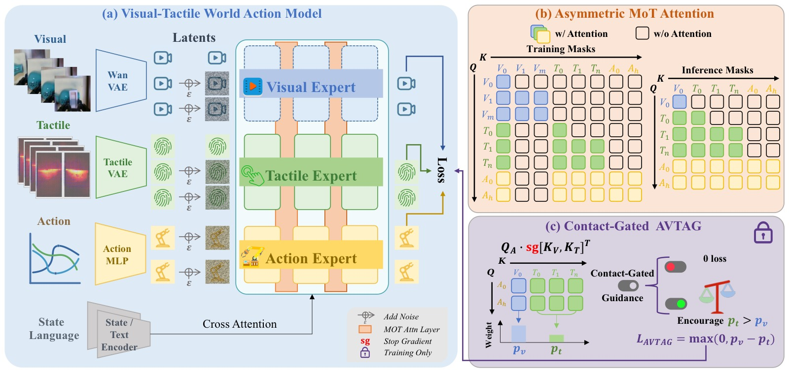

<!-- arxiv: 2607.02503 -->
<!-- venue: ICRA 2026（投稿中） -->
<!-- tags: WAM, 触觉, 世界模型, 机器人操作 -->

# VT-WAM: Visual-Tactile World Action Model for Contact-Rich Manipulation

> **论文信息**
> - 作者：Shuai Tian, Yupeng Zheng, Yuhang Zheng, Songen Gu, Yujie Zang, Yuxing Qin, Weize Li, Haoran Li, Wenchao Ding, Dongbin Zhao
> - 通讯作者：Haoran Li, Wenchao Ding (CASIA / TARS Robotics)
> - 投稿方向：IEEE 会议（ICRA/IROS 级别）
> - arXiv ID：2607.02503
> - 项目：https://vt-wam.github.io/
>
> 本文基于以下本地材料整理：
>
> - 论文 TeX 源码：`arXiv-2607.02503v1/`（主文件：`root.tex`，按 `sections/` 分章节）
> - 论文插图：`pics/VTWAM_fig*.pdf/png`（6 张图）
> - 本文图片导出目录：`assets/vtwam/`

---

## 一、核心问题

World Action Model (WAM) 将未来视觉预测与动作预测统一在 flow matching 框架中。但现有 WAM 仅建模视觉动力学，忽略了触觉形变——而这对接触-rich 操作至关重要。

> VT-WAM 在 WAM 框架中首次引入触觉形变动力学建模，通过 Asymmetric MoT Attention 和 Contact-Gated AVTAG 实现视觉-触觉-动作的联合预测。

*图1：VT-WAM 架构。(a) 三个模态专用 expert（视觉/触觉/动作）通过 Asymmetric MoT Attention 连接；(b) 非对称注意力掩码——视觉不可见触觉/动作，触觉仅见首帧视觉锚点，动作可见首帧视觉+全部触觉；(c) AVTAG：训练时的接触门控辅助损失，推动动作 query 在接触阶段依赖触觉证据。*

---

## 二、核心方法

### 2.1 三 Expert 架构

| Expert | 输入 | 功能 |
|--------|------|------|
| Visual (Wan2.2-5B) | 手腕 RGB | 全局场景上下文 |
| Tactile (1B DiT) | Xense 3D 形变场 | 局部接触动力学 |
| Action (1B DiT) | 动作块 | 从视觉+触觉证据预测动作 |

### 2.2 Asymmetric MoT Attention

核心动机：推理时不需要生成未来视觉，所以动作只应看首帧视觉锚点 + 全部触觉序列。

| Query \ Key | 首帧视觉 | 未来视觉 | 触觉 | 动作 |
|-------------|:-------:|:-------:|:---:|:---:|
| Visual | ✓ | ✓ | ✗ | ✗ |
| Tactile | ✓ | ✗ | ✓ | ✗ |
| Action | ✓ | ✗ | ✓ | ✓ |

> 训练时保持视觉分支用于联合优化，推理时移除未来视觉 token，仅保留首帧视觉锚点 + 触觉序列。

### 2.3 Contact-Gated AVTAG

视觉和触觉信号天然不平衡：视觉密集且持续，触觉稀疏且仅在接触时激活。AVTAG 在训练时添加辅助损失：

$$\mathcal{L}_{\text{AVTAG}} = \mathbb{1}_{\text{contact}} \cdot \max(0, \alpha_v - \alpha_t + m)$$

- 计算动作 query → 视觉/触觉 key 的相对注意力权重 $\alpha_v, \alpha_t$
- 仅在接触阶段激活（触觉形变幅值 > 阈值）
- 惩罚 $\alpha_t < \alpha_v + m$ 的情况
- Hinge loss margin $m$ 推动动作在接触时优先关注触觉

---

## 三、实验与结果

### 3.1 任务设置

xArm7 + Xense 触觉传感器，6 个真机任务：

| 类别 | 任务 | 特点 |
|------|------|------|
| 表面交互 | Wipe Board, Wipe Vase, Peel Cucumber | 持续接触运动 |
| 约束插入 | Insert Plug, Swipe Card, Insert Tube | 精密对齐（Insert Tube 为透明管，视觉不可靠） |

每任务 100 条 kinesthetic teaching 演示。

### 3.2 操作性能

| 方法 | 表面交互 | 约束插入 | 总平均 |
|------|:------:|:------:|:-----:|
| DP + Tactile | -- | -- | -- |
| RDP | -- | -- | -- |
| π₀.₅ | 36.67% | -- | -- |
| OmniVTLA | 33.33% | 38.33% | 35.83% |
| Fast-WAM | 56.67% | 33.33% | 45.00% |
| **VT-WAM** | **81.67%** | **61.67%** | **71.67%** |

> +26.67% over Fast-WAM, +35.84% over OmniVTLA。表面交互任务上 π₀.₅ (36.67%) ≈ OmniVTLA (33.33%)，说明仅把触觉作为策略输入而不建模其动力学不足以提升性能。

### 3.3 触觉预测质量

| 方法 | L2 ↓ | Cos ↑ |
|------|:----:|:----:|
| exUMI | 0.091 | 0.618 |
| UVA | 0.083 | 0.667 |
| **VT-WAM** | **0.077** | **0.749** |

### 3.4 消融

在 Wipe Vase + Insert Tube 上：

| 消融 | Wipe Vase | Insert Tube |
|------|:--------:|:----------:|
| Fast-WAM (M₀) | 55% | 25% |
| + Symmetric MoT (T Seq.) | 65% | 40% |
| + Asymmetric (T₀ only) | 40% | 30% |
| + Asymmetric (T Seq.) | 70% | 50% |
| + AVTAG | **90%** | **70%** |

> 非对称注意力 + AVTAG 两者缺一不可。仅用首帧触觉（T₀）反而比对称注意力更差，因为丢失了接触演化信息；不加 AVTAG 时动作容易偏向视觉证据而忽略触觉。

---

## 四、关键洞察

1. **建模触觉动力学比触觉作为条件输入更重要**：OmniVTLA 把触觉当策略输入但成功率不如纯视觉 π₀.₅——触觉信号不加合理建模反而可能成为噪声。

2. **非对称读出的推理效率**：推理时跳过未来视觉生成，只保留首帧视觉锚点，大幅降低推理延迟。

3. **AVTAG 解决模态不平衡**：触觉天然稀疏，标准 joint training 会让模型偏向视觉。Contact-gated hinge loss 在接触阶段强制动作关注触觉。

4. **Insert Tube 上的视觉失效**：透明管使视觉对齐不可靠，VT-WAM 的触觉动力学建模在此任务上优势尤其明显。
