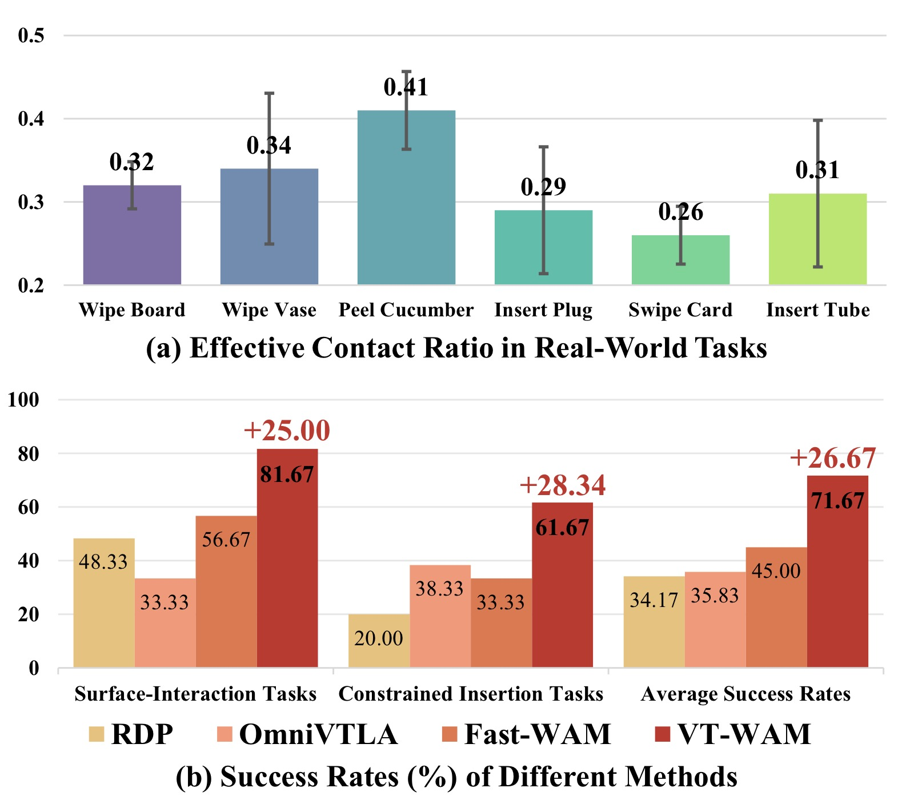
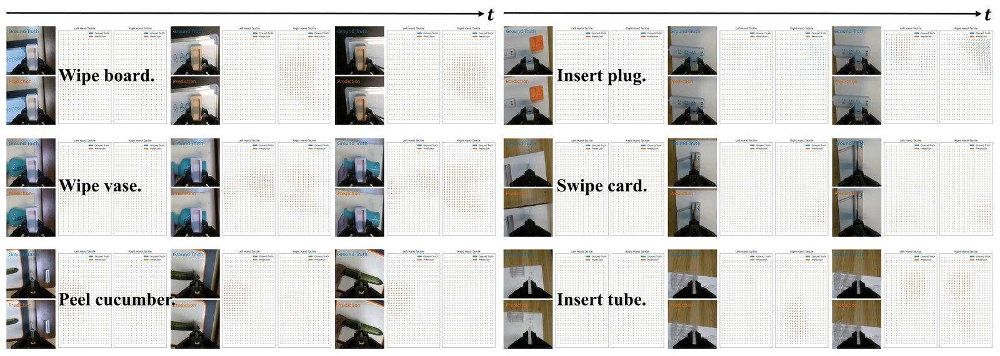
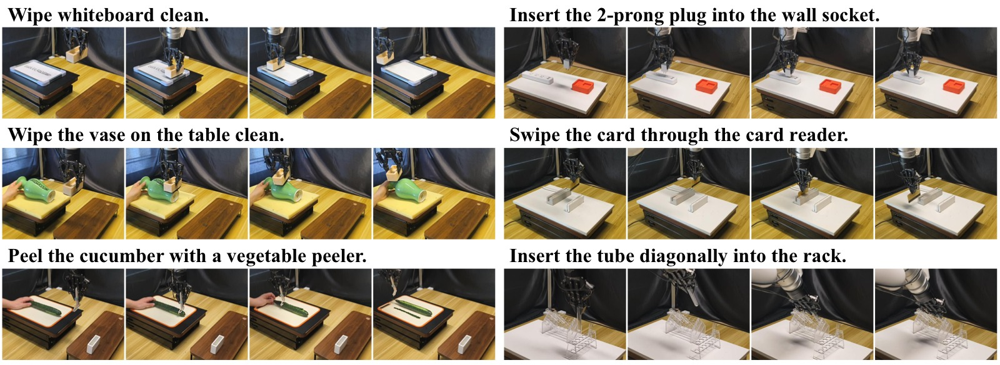

<!-- arxiv: 2607.02503 -->
<!-- venue: ICRA 2026（投稿中） -->
<!-- tags: WAM, 触觉, 世界模型, 机器人操作 -->

# VT-WAM: Visual-Tactile World Action Model for Contact-Rich Manipulation

> **论文信息**
> - 作者：Shuai Tian, Yupeng Zheng, Yuhang Zheng, Songen Gu, Yujie Zang, Yuxing Qin, Weize Li, Haoran Li, Wenchao Ding, Dongbin Zhao
> - 通讯作者：Haoran Li, Wenchao Ding (CASIA / TARS Robotics)
> - 投稿方向：IEEE ICRA 2026
> - arXiv ID：2607.02503
> - 项目：https://vt-wam.github.io/
>
> 本文基于以下本地材料整理：
>
> - 论文 TeX 源码：`arXiv-2607.02503v1/`（主文件：`root.tex`，按 `sections/` 分章节）
> - 论文插图：`pics/VTWAM_fig*.pdf/png`（6 张图）
> - 本文图片导出目录：`assets/vtwam/`

---

## 一、核心问题

World Action Model (WAM) 将未来视觉预测与动作预测统一在 flow matching 框架中，但现有 WAM 仅建模视觉动力学。触觉是接触-rich 操作中唯一能揭示局部形变、压力、滑移和摩擦的信号——然而直接将触觉作为策略输入（如 OmniVTLA）甚至不如纯视觉 π₀.₅（36.67% vs 33.33%），因为不加合理建模的触觉信号可能成为噪声。

> VT-WAM 首次在 WAM 框架中引入触觉形变动力学建模。两个核心创新：Asymmetric MoT Attention 匹配视觉-触觉-动作的非对称信息流，Contact-Gated AVTAG 推动动作在接触阶段优先关注触觉证据。

*图1：VT-WAM 概览。(a) 触觉形变序列可视化——注意接触时的局部高应力和非接触时的静止；(b) VT-WAM 输出——视觉预测 + 触觉预测 + 动作。*

---

## 二、核心方法

### 2.1 三 Expert 架构

VT-WAM 使用视觉-触觉-动作三 Expert 架构，通过 Asymmetric MoT Attention 连接：

| Expert | 骨干 | 规模 | 功能 |
|--------|------|:---:|------|
| Visual | Wan2.2-5B (VAE 编码器) | 5B | 全局场景上下文 |
| Tactile | DiT | 1B | 局部接触形变动力学 |
| Action | DiT | 1B | 从视觉+触觉证据预测动作块 |

每个 Expert 维护自己的 token stream：
- 视觉 token $\mathbf{X}_v \in \mathbb{R}^{N_v \times d}$（Wan2.2 VAE patchified）
- 触觉 token $\mathbf{X}_t \in \mathbb{R}^{N_t \times d}$（OmniVTA 预训练 TactileVAE）
- 动作 token $\mathbf{X}_a \in \mathbb{R}^{S_a \times d}$（线性投影）

语言指令和本体感知通过 cross-attention 注入各 Expert。

### 2.2 Asymmetric MoT Attention

*图2：(a) 三 Expert 架构——Asymmetric MoT Attention 控制跨模态信息流；(b) 训练/推理时的注意力掩码；(c) AVTAG 接触门控辅助损失。*

**动机**：
1. 视觉主要提供全局场景上下文——动作不应被未来视觉幻觉误导
2. 触觉序列编码接触演化——动作必须能获取完整触觉序列
3. 推理时生成未来视觉增加不必要延迟——应该可以跳过

**非对称信息流设计**：

在每个 MoT Attention 层，query/key/value 按 `[visual; tactile; action]` 顺序拼接，应用 blockwise mask $\mathbf{M}$：

| Query \ Key | 首帧视觉锚点 | 未来视觉 | 触觉序列 | 动作 |
|-------------|:--------:|:------:|:------:|:---:|
| **Visual** | ✓ | ✓ | ✗ | ✗ |
| **Tactile** | ✓ | ✗ | ✓ | ✗ |
| **Action** | ✓ | ✗ | ✓ | ✓ |

**设计理由**：
- Visual 不见 Tactile：保持视觉表示稳定，不被局部形变干扰
- Tactile 仅见首帧视觉锚点：ground 触觉动力学在全局场景下，但不依赖未来视觉噪声
- Action 见首帧视觉锚点 + 全部触觉：需要全局上下文和完整的接触演化信息
- 同模态 self-attention 始终保留

**推理时的关键效率优化**：
- 训练时保持三流并行的 joint flow matching（视觉+触觉+动作一起优化）
- 推理时**移除未来视觉 token 和视觉专家**
- 仅保留首帧视觉锚点（KV cache）+ Tactile Expert + Action Expert
- 动作 tokens attend 首帧视觉 + 正在去噪的触觉潜序列
- 消除视觉生成的延迟——同时保留接触动力学建模

### 2.3 Contact-Gated AVTAG

**问题**：视觉信号密集且持续，触觉信号稀疏且仅在接触时激活。Standard joint training 可以通过依赖视觉证据大幅降低训练 loss——导致模型忽视触觉动态。

**AVTAG 方案**：训练时的接触门控辅助损失。

对于每个 MoT Attention 层，计算 action query 对视觉/触觉 key 的辅助注意力分布（对 key 停止梯度）：

$$\alpha_v = \text{softmax}(\mathbf{Q}_a \cdot \mathbf{K}_v^\top / \sqrt{d}), \quad \alpha_t = \text{softmax}(\mathbf{Q}_a \cdot \mathbf{K}_t^\top / \sqrt{d})$$

接触门控 hinge loss：

$$\mathcal{L}_{\text{AVTAG}} = \mathbb{1}_{\text{contact}} \cdot \max(0, \alpha_v - \alpha_t + m), \quad \lambda_{\text{AVTAG}} = 0.05$$

- 门控条件：触觉形变幅值 > 阈值 → contact phase
- Hinge margin $m$ 推动 $\alpha_t > \alpha_v + m$：在接触阶段强制动作关注触觉证据
- 仅在训练时激活，不增加推理开销

**与标准 attention 的关系**：AVTAG 是辅助损失，不修改主 attention path——仅推动训练时的注意力分布，不限制测试时的信息流。

---

## 三、实验

### 3.1 设置

xArm7 + Xense（35×20×3 marker displacement），6 个真机任务：

| 类别 | 任务 | 接触特性 |
|------|------|---------|
| 表面交互 | Wipe Board | 持续接触，平面 |
| 表面交互 | Wipe Vase | 持续接触，曲面 |
| 表面交互 | Peel Cucumber | 切割+剥离，变形体 |
| 约束插入 | Insert Plug | 紧密公差对齐 |
| 约束插入 | Swipe Card | 狭缝插入，盲操作 |
| 约束插入 | Insert Tube | 透明管——视觉对齐不可靠 |

每任务 100 条 kinesthetic teaching 演示，20 次独立评估。

### 3.2 操作性能

| 方法 | 表面交互 | 约束插入 | 总平均 |
|------|:------:|:------:|:-----:|
| DP + Tactile | -- | -- | -- |
| RDP | -- | -- | -- |
| π₀.₅ | 36.67 | -- | -- |
| OmniVTLA | 33.33 | 38.33 | 35.83 |
| Fast-WAM | 56.67 | 33.33 | 45.00 |
| **VT-WAM** | **81.67** | **61.67** | **71.67** |

> VT-WAM vs Fast-WAM: +26.67% 绝对提升。表面交互任务上纯视觉策略表现极差——手腕相机变化微小，而接触发生在局部交互面。Insert Tube 上视觉对齐困难（透明管），VT-WAM 的触觉动力学建模优势尤为明显。

### 3.3 触觉预测质量

*图3：六任务的视觉-触觉预测结果。VT-WAM 预测手腕相机观测和触觉形变场的一致性，包括压力集中和接触迁移。蓝=真值，橙=预测。*

| 方法 | L2 ↓ | Cos ↑ |
|------|:----:|:----:|
| exUMI | 0.091 | 0.618 |
| UVA | 0.083 | 0.667 |
| **VT-WAM** | **0.077** | **0.749** |

> L2 计算全 3D 形变场误差，Cos 仅计算非零形变区域的方向一致性。

### 3.4 消融实验（Wipe Vase + Insert Tube）

| 模型 | 描述 | Wipe Vase | Insert Tube |
|------|------|:--------:|:----------:|
| M₀ | Fast-WAM (baseline) | 55% | 25% |
| M₁ | M₀ + Symmetric MoT (T Seq.) | 65% | 40% |
| M₂ | M₀ + Asymmetric (only T₀) | 40% | 30% |
| M₃ | M₀ + Asymmetric (T Seq.) | 70% | 50% |
| M₄ | M₃ + AVTAG | **90%** | **70%** |

关键消融解读：

1. **M₁ vs M₀**：加入触觉序列（对称注意力）比纯视觉好——触觉动力学提供有用信息 ✓
2. **M₂ vs M₀**：仅用首帧触觉（T₀）反而不如无触觉——单帧触觉无动力学，成为噪声 ✗
3. **M₃ vs M₁**：非对称注意力优于对称——推理效率+专注力 ✗
4. **M₄ vs M₃**：AVTAG 贡献最大——接触门控解决了模态不平衡 +20pp

### 3.5 消融图

*图4：各消融变体在六个任务上的成功率和接触步数的综合对比。AVTAG 在所有任务上贡献最大。*

---

## 四、关键洞察

1. **"不加建模的触觉不如没有触觉"**：OmniVTLA（触觉作策略输入）33.33% < π₀.₅（纯视觉）36.67%。这证明仅把触觉当额外输入 token 不足以提取价值——需要明确建模触觉动力学。

2. **首帧触觉锚点设计**：T₀ 单独反而不如无触觉（M₂: 40%/30% < M₀: 55%/25%在 Wipe Vase 上），因为单帧触觉只是空间快照，无时序信息。需要完整触觉序列才能捕获接触演化。

3. **AVTAG 的四两拨千斤**：Hinge loss 的 margin 推了一把——在接触阶段强制 action 关注触觉而非视觉。仅 0.05 的 loss 权重贡献了整个消融中最大的收益。

4. **推理跳过的视觉生成 = 实质性的延迟改善**：视觉 DiT（5B 参数）的去噪比触觉 DiT（1B）慢 5 倍。跳过未来视觉生成使 VT-WAM 的推理频率接近纯动作模型。

5. **Insert Tube 的透明性是最佳测试**：当前所有 visuotactile 方法在透明物体上测试不足——Insert Tube 证明视觉对齐在此场景下不可靠，触觉动力学建模是唯一的出路。

---

## 五、训练与推理细节

**训练**：AdamW lr=1e-4, weight decay=1e-2, bf16, gradient clip 1.0, cosine decay with 5% warmup, A100 (80GB)。

**推理**：远程 A100 推理服务器，10 denoising steps, visual-cache mode（跳过未来视觉）。

**损失权重**：$\lambda_v = \lambda_t = \lambda_a = 1$, $\lambda_{\text{AVTAG}} = 0.05$。
